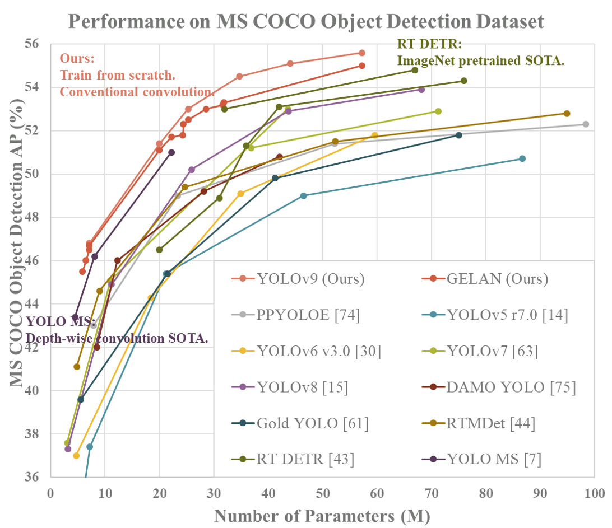
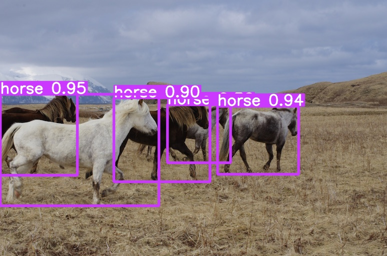

# YOLOv9

原始论文链接：[YOLOv9: Learning What You Want to Learn Using Programmable Gradient Information](https://arxiv.org/abs/2402.13616)

原始代码仓库：[github](https://github.com/WongKinYiu/yolov9)

[](https://arxiv.org/abs/2402.13616)
[](https://huggingface.co/spaces/kadirnar/Yolov9)
[](https://huggingface.co/merve/yolov9)
[](https://colab.research.google.com/github/roboflow-ai/notebooks/blob/main/notebooks/train-yolov9-object-detection-on-custom-dataset.ipynb)
[](https://learnopencv.com/yolov9-advancing-the-yolo-legacy/)

<div align="center">
    <a href="./">
        
    </a>
</div>


## 工具性能

MS COCO

| Model | Test Size | AP<sup>val</sup> | AP<sub>50</sub><sup>val</sup> | AP<sub>75</sub><sup>val</sup> | Param. | FLOPs |
| :-- | :-: | :-: | :-: | :-: | :-: | :-: |
| [**YOLOv9-T**](https://github.com/WongKinYiu/yolov9/releases/download/v0.1/yolov9-t-converted.pt) | 640 | **38.3%** | **53.1%** | **41.3%** | **2.0M** | **7.7G** |
| [**YOLOv9-S**](https://github.com/WongKinYiu/yolov9/releases/download/v0.1/yolov9-s-converted.pt) | 640 | **46.8%** | **63.4%** | **50.7%** | **7.1M** | **26.4G** |
| [**YOLOv9-M**](https://github.com/WongKinYiu/yolov9/releases/download/v0.1/yolov9-m-converted.pt) | 640 | **51.4%** | **68.1%** | **56.1%** | **20.0M** | **76.3G** |
| [**YOLOv9-C**](https://github.com/WongKinYiu/yolov9/releases/download/v0.1/yolov9-c-converted.pt) | 640 | **53.0%** | **70.2%** | **57.8%** | **25.3M** | **102.1G** |
| [**YOLOv9-E**](https://github.com/WongKinYiu/yolov9/releases/download/v0.1/yolov9-e-converted.pt) | 640 | **55.6%** | **72.8%** | **60.6%** | **57.3M** | **189.0G** |
<!-- | [**YOLOv9 (ReLU)**]() | 640 | **51.9%** | **69.1%** | **56.5%** | **25.3M** | **102.1G** | -->

<!-- tiny, small, and medium models will be released after the paper be accepted and published. -->

# 环境配置
python版本使用3.8，环境直接使用配置好的requirements.txt
```shell
conda create -n py38Yolov9 python=3.8
pip install -r requirements.txt
```

# 数据下载
测试过程先偷懒直接使用案例里面的小马图片吧

# 使用介绍

## Object Detection

### 样例运行

使用前需要下载对应模型参数
```text
├── ./README.md
├── ./ckpt
│    ├── ./ckpt/gelan-c-det.pt
│    └── ./ckpt/yolov9-c-converted.pt
├── ./scripts
```

```shell
# GPU版本
python detect.py --source './data/images/horses.jpg' --img 640 --device 0 --weights './yolov9-c-converted.pt' --name yolov9_c_c_640_detect

# CPU版本
python detect.py --source './data/images/horses.jpg' --img 640 --device cpu --weights './yolov9-c-converted.pt' --name yolov9_c_c_640_detect
```

模型会输出运行耗时以及输出路径，并输出小马的物体识别结果
```text
gelan-c summary: 387 layers, 25288768 parameters, 64944 gradients, 102.1 GFLOPs
image 1/1 Your-Base-Dir/Multimodal-Toolkit/object_detection/yolov9/data/images/horses.jpg: 448x640 5 horses, 97.4ms
Speed: 0.3ms pre-process, 97.4ms inference, 0.5ms NMS per image at shape (1, 3, 640, 640)
Results saved to runs/detect/yolov9_c_c_640_detect
```


### 功能拆解
在/scripts/run_object_detection.py里面实现了对于单图片物体检测的代码拆解，运行代码如下：
```shell
python -m scripts.run_object_detection
```
核心过程为：
1. 建立数据流和模型
```python
dataset = LoadImages(source, img_size=imgsz, stride=stride, auto=pt, vid_stride=vid_stride)
model = DetectMultiBackend(weights, device=device, dnn=dnn, data=data, fp16=half)
# model.name中存放了index -> label的映射表，例如：{0: 'person', 1: 'bicycle'}
```
2. 执行模型推理

模型输出结果pred的格式为：[2, batch, 84, 5880]
- pred[0] (Lead Head)：主检测头。这是模型最准的输出，最终的检测结果、NMS 后的框都是从这里产生的。
- pred[1] (Auxiliary Head)：辅助检测头。在训练阶段，它负责辅助主头学习特征；在推理阶段，某些模型版本会同时输出它，但在实际使用（NMS）时通常只取 pred[0]。
- 84: 内容组。包含 4 个坐标分量 + 80 个类别的得分。
- 5880: 预测框的总数。这是不同尺度的特征图叠加后的结果。
```python
pred = model(im, augment=augment, visualize=visualize)
```
3. 执行后处理（非极大值抑制）

运行后的结果 pred： 形状会变为 list，其中每个元素是形状为 [N, 6] 的 Tensor，每一行代表一个物体：[x1, y1, x2, y2, confidence, class_id]。
其工作流程可以概括为：
    
- 先过滤：根据pred中给出的置信度，扔掉分太低的候选框（conf_thres）。 
- 再转换：把坐标转为像素格式，确定每个框最像哪个类。
- 后去重：利用 贪心算法，在重叠严重（iou_thres）的框中选出最强的那个，剩下的全部踢出。
- 控总量：最后只取前 max_det 个最靠谱的结果返回。

其入参含义如下：

- conf_thres(置信度阈值)：初筛阶段分值低于此阈值的框直接被扔掉。数值越高，结果越“干净”，但也容易漏掉不明显的物体。
- iou_thres(IoU阈值)：去重阶段判断两个框重叠程度的上限（交并比）。如果两个框 IoU 超过这个值，则只保留得分高的。数值越小，去重越狠。
- classes(类别过滤器)：如果你只关心某些类（比如只要“人”），传入类别 ID 列表（如 [0]），它会自动过滤掉其他所有类。
- agnostic_nms(类无关NMS)：
  - False (默认): 不同类别的框即使重叠也不会互相抑制（如人和车重叠）。
  - True: 全局竞争，重叠严重的框只留得分最高的，不管它们是什么类。
- max_det(最大检测数)：每张图片最终保留的物体上限（如 300 个）。防止因模型误报产生数千个框导致后续绘制或跟踪程序崩溃。
```python
pred = non_max_suppression(pred, conf_thres, iou_thres, classes, agnostic_nms, max_det=max_det)
```

# 踩坑记录