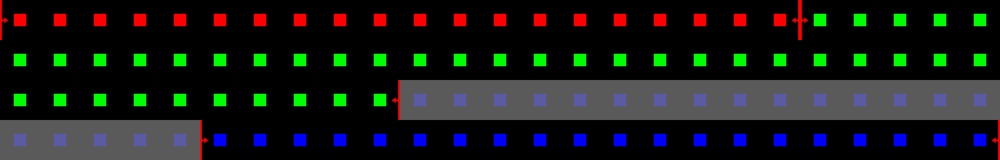

# TransNet V2: Shot Boundary Detection Neural Network

原始论文链接: [TransNet V2: An effective deep network architecture for fast shot transition detection](https://arxiv.org/abs/2008.04838).

原始代码仓库: [github](https://github.com/soCzech/TransNetV2)

工具评测指标 (F1 scores):

Model | ClipShots | BBC Planet Earth | RAI
--- | :---: | :---: | :---:
TransNet V2 (this repo) | **77.9** | **96.2** | 93.9
[TransNet](https://arxiv.org/abs/1906.03363) [(github)](https://github.com/soCzech/TransNet) | 73.5 | 92.9 | **94.3**
[Hassanien et al.](https://arxiv.org/abs/1705.03281) [(github)](https://github.com/melgharib/DSBD) | 75.9 | 92.6 | 93.9
[Tang et al., ResNet baseline](https://arxiv.org/abs/1808.04234) [(github)](https://github.com/Tangshitao/ClipShots_basline) | 76.1 | 89.3 | 92.8

# 环境配置
原作者对于训练和推理都给了对应的docker镜像，同时在inference和inference-pytorch文件夹下也都有对应的readme文件，其中包含了环境介绍与使用介绍。
在没有docker的情况下，使用python3.8配合requirements.txt可以实现基于pytorch的推理：

```shell
conda create -n py38TransNetV2 python=3.8
conda activate py38TransNetV2

pip install -r requirements.txt

# 安装ffmpeg
# 正确安装方式（1）
conda install ffmpeg

# 正确安装方式（2）
brew install ffmpeg
pip install ffmpeg-python

# 检查ffmpeg安装成功
ffmpeg -version
```

# 数据下载
- 下载 RAI & BBC Planet Earth 测试集： [下载链接](https://aimagelab.ing.unimore.it/imagelab/researchActivity.asp?idActivity=19) 
- 下载 ClipShots 训练/测试集： [下载链接](https://github.com/Tangshitao/ClipShots)

数据集下载后放在项目公用的data文件夹下即可：
```text
├── ./README.md
├── ./data
│   └── ./data/RAIDataset
│       ├── ./data/RAIDataset/README.txt
│       ├── ./data/RAIDataset/scenes_1.txt
│       ├── ...
│   └── ./data/RAIDataset/videos
│       ├── ./data/RAIDataset/videos/1.mp4
│       ├── ....
```

# 使用介绍

## 模拟数据调试
运行下述代码可以实现使用伪数据进行的模型调用调通和可视化工具调通：
```shell
cd scene_detection/TransNetV2
python -m script.run_fake
```
预期结果如下：
- 尝试伪造一个input_tensor测试模型，输出内容single_frame_pred是一个和frames等长的序列，sigmoid之后表示每一帧可能是转场的概率

```text
[INFO] input_shape: torch.Size([1, 100, 27, 48, 3])
[INFO] single_frame_pred: (1, 100, 1)
[INFO] all_frame_pred: (1, 100, 1)
```
- 尝试伪造一个视频，每帧中间有个正方形，不同场景下的正方形颜色不同。随后伪造预测的场景范围使用可视化工具，输出如下：
  - 图片会被按时间顺序平铺开，被标记为一个场景的帧左右会有红色箭头
  - 未被标记为场景的帧，会被刷上一层灰色蒙版

```text
>>> 测试可视化工具
片段 0: 帧范围 0-19, 长度 20, 颜色 [255, 0, 0]
片段 1: 帧范围 20-59, 长度 40, 颜色 [0, 255, 0]
片段 2: 帧范围 60-99, 长度 40, 颜色 [0, 0, 255]
可视化图片已生成: Multimodal-Toolkit/scene_detection/TransNetV2/img/visualization_demo.png

```


# 踩坑记录
- 视频读入方式上，ffmpeg相比opencv有4倍的速度提升，优先使用代码库中的经典代码:
```python
import ffmpeg
import numpy as np

def get_frames(fn, width=48, height=27):
    video_stream, err = (
        ffmpeg
        .input(fn)
        .output('pipe:', format='rawvideo', pix_fmt='rgb24', s='{}x{}'.format(width, height))
        .run(capture_stdout=True, capture_stderr=True)
    )
    video = np.frombuffer(video_stream, np.uint8).reshape([-1, height, width, 3])
    return video
```