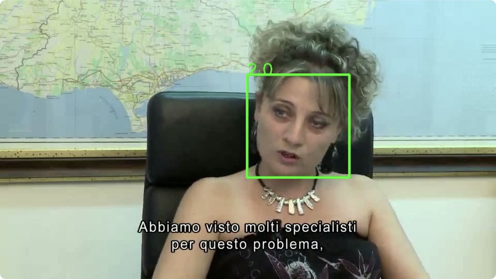

# A Light Weight Model for Active Speaker Detection

[](https://paperswithcode.com/sota/audio-visual-active-speaker-detection-on-ava?p=a-light-weight-model-for-active-speaker)

原始论文链接: [paper](https://openaccess.thecvf.com/content/CVPR2023/papers/Liao_A_Light_Weight_Model_for_Active_Speaker_Detection_CVPR_2023_paper.pdf) (CVPR 2023) \
原始代码仓库: [github](https://github.com/soCzech/TransNetV2)

> A Light Weight Model for Active Speaker Detection  
> Junhua Liao, Haihan Duan, Kanghui Feng, Wanbing Zhao, Yanbing Yang, Liangyin Chen

扩展版论文链接: [LR-ASD: Lightweight and Robust Network for Active Speaker Detection](https://junhua-liao.github.io/Junhua-Liao/publications/papers/IJCV_2025.pdf) (IJCV 2025) \
扩展版代码仓库: [github](https://github.com/Junhua-Liao/LR-ASD)

# 环境配置
```shell
conda create -n py38LightASD python=3.8
conda activate py38LightASD

pip install -r requirements.txt
```

# 数据下载
偷懒使用一下仓库里公共的数据集吧！

# 使用介绍

```shell
python scripts/run.py --video_path ../../data/RAIDataset/videos/1.mp4

# gpu版本和mps版本
python scripts/run.py --video_path ../../data/RAIDataset/videos/1.mp4 --device cude
python scripts/run.py --video_path ../../data/RAIDataset/videos/1.mp4 --device mps
```
最终可视化结果为带有人脸检测框的视频，绿色表示人在说话，红色表示不在说话：


## 模型参数下载
sfd_face.pth权重在github上的网盘链接已经失效，可以前往仓库下载：
- 已验证：[sfd_face.pth](https://huggingface.co/lithiumice/syncnet/tree/main)
- 备用：[s3fd.pth](https://huggingface.co/spaces/manavisrani07/gradio-lipsync-wav2lip/blob/a9a9fcdf8d8812be592c40417812ac64fc6f13fa/face_detection/detection/sfd/s3fd.pth)

# 踩坑记录

### numpy.int问题
如果无法降低numpy的版本，导致不支持np.int的写法，需要修改为np.int32
```python
def nms_(dets, thresh):
    """
    Courtesy of Ross Girshick
    [https://github.com/rbgirshick/py-faster-rcnn/blob/master/lib/nms/py_cpu_nms.py]
    """
    ...
    
    # return np.array(keep).astype(np.int)
    return np.array(keep).astype(np.int32)
```

### mps上的max_pool3d支持问题
PyTorch在MP（Apple Silicon GPU）上还不支持max_pool3d这个操作。
可以通过设置环境变量，再特定函数不支持的情况话回退到CPU上运行：
```python
import os
os.environ['PYTORCH_ENABLE_MPS_FALLBACK'] = '1'
```

# 扩展阅读

## 预处理流程

代码执行逻辑按照以下6步执行：
- 多媒体提取：使用ffmpeg 将视频统一转为 25fps，提取音频并把视频拆解成一帧帧的图片。
- 场景切换检测：使用scenedetect找出视频中的镜头切换点，确保人脸追踪不会跨越不同的镜头。
- 人脸检测：使用S3FD模型在每一帧中寻找人脸位置。
- 人脸追踪：在每个镜头内，将不同帧的人脸连接成“轨迹”（Track），并对缺失帧进行插值。
- ASD模型推理：将人脸画面和对应的音频输入深度学习模型，计算每一帧“正在说话”的概率分数。
- 可视化：将计算结果绘回原视频，生成带标注的成品。
