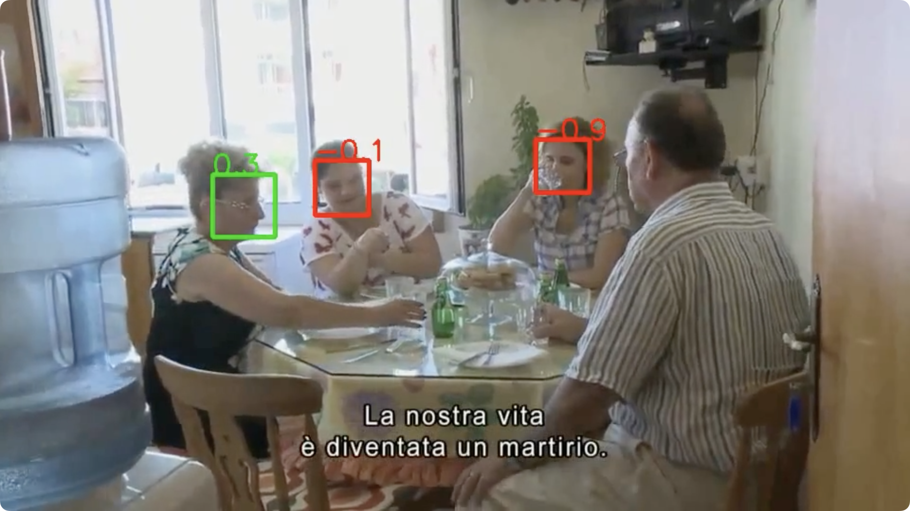

## Is someone talking? TalkNet: Audio-visual active speaker detection Model

原始论文链接：[Arxiv](https://arxiv.org/pdf/2107.06592.pdf) \
原始仓库链接：[github](https://github.com/TaoRuijie/TalkNet-ASD/) 

# 环境配置
```shell
# 原始环境使用了python3.7.9，但好像有些conda最低也只支持到3.8了
conda create -n py38TalkNet python=3.8
conda activate py38TalkNet
pip install -r requirement.txt
```

# 数据下载
继续偷懒使用公共数据集RAIDataset先跑通实验。

# 使用介绍
```shell
python scripts/run.py --video_path ../../data/RAIDataset/videos/1.mp4 --device mps
```
最终可视化结果为带有人脸检测框的视频，绿色表示人在说话，红色表示不在说话，可以同时识别多个人：


# 踩坑记录

### numpy.int问题
和Light-ASD存在同样的问题，如果无法降低numpy的版本，导致不支持np.int的写法，需要修改为np.int32
```python
def nms_(dets, thresh):
    """
    Courtesy of Ross Girshick
    [https://github.com/rbgirshick/py-faster-rcnn/blob/master/lib/nms/py_cpu_nms.py]
    """
    ...
    
    # return np.array(keep).astype(np.int)
    return np.array(keep).astype(np.int32)
```

### mps上的max_pool3d支持问题
这个也是和Light-ASD问题一样，PyTorch在MP（Apple Silicon GPU）上还不支持max_pool3d这个操作。
可以通过设置环境变量，再特定函数不支持的情况话回退到CPU上运行：
```python
import os
os.environ['PYTORCH_ENABLE_MPS_FALLBACK'] = '1'
```
